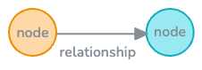
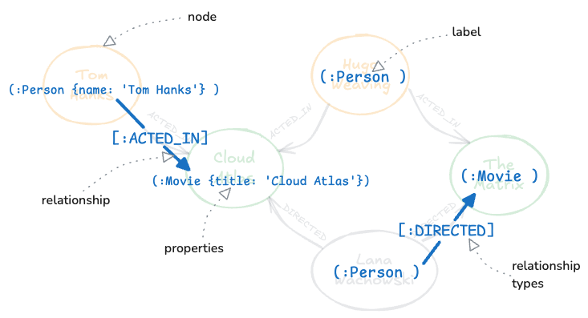

# Bancos de dados de grafos

### O que são bancos de dados de grafos (graph databases)?

Grafos (graphs) são estruturas matemáticas compostas por arestas (edges) e vértices (vertices).
O Neo4j armazena e organiza dados usando nós (nodes), relacionamentos (relationships), rótulos (labels) e propriedades (properties).



### Quando os grafos são úteis?

Grafos são particularmente úteis quando:
- O problema exige compreender os relacionamentos entre entidades.
- O problema envolve uma hierarquia.
- O problema requer explorar relacionamentos de profundidade variável ou desconhecida.
- O problema exige avaliar rotas ou caminhos em uma rede.


# Neo4j

Neo4j é um banco de dados de grafos, ou seja, armazena informações em forma de nós (nodes) e relacionamentos. 
Esse modelo é útil quando as conexões entre os dados são tão importantes quanto os próprios dados.

Nós (nodes): representam entidades ou objetos, como pessoas, empresas ou locais. 
Eles podem ter rótulos (labels) que indicam o tipo de entidade (ex.: Pessoa, Empresa). 
Um nó pode ter múltiplos rótulos, como “Pessoa” e “Funcionário”.

Relacionamentos: são as conexões (arestas) entre nós. 
Têm um tipo (ex.: trabalha em, fundado em) e direção (ex.: Michael trabalha na Neo4j). 
Relacionamentos também podem ser bidirecionais.

Propriedades: tanto nós quanto relacionamentos podem ter atributos no formato chave-valor (ex.: nome, cargo). 
Essas propriedades podem ser de diferentes tipos de dados (inteiro, string, booleano, lista) e até funcionarem como identificadores únicos.

O modelo do Neo4j, chamado de grafo de propriedades com rótulos (labelled property graph), é flexível, pois dá a mesma importância aos dados e às conexões entre eles.


### Grafos de Conhecimento e Inteligência Artificial Generativa

Os grafos tornaram-se uma parte importante no desenvolvimento de aplicações de Inteligência Artificial Generativa (Generative AI / GenAI).
Essas aplicações precisam de acesso ao significado nos dados, e os grafos de conhecimento (knowledge graphs) fornecem esse contexto.

### Casos de uso em Neo4j e GenAI

Há muitos casos de uso combinando Neo4j e GenAI, incluindo:
- Busca vetorial (vector search)
- Grafos de conhecimento (knowledge graph)
- Ciência de dados (data science)


# Neo4j AuraDB

AuraDB é um serviço de nuvem totalmente gerenciado (fully managed cloud service) que fornece um banco de dados Neo4j como serviço (Neo4j database as a service).

Trata-se de um serviço de banco de dados em nuvem totalmente gerenciado, escalável e seguro (fully managed, scalable, and secure cloud database service), que permite que você se concentre no desenvolvimento de aplicações sem se preocupar com os aspectos operacionais da administração de um banco de dados.

https://neo4j.com/product/auradb/

# Links

- [Neo4j](https://neo4j.com/)
- [Manual do Cypher](https://neo4j.com/docs/cypher-manual/current/introduction/)
- [Cypher Cheat Sheet](https://neo4j.com/docs/cypher-cheat-sheet/5/all/)
- [Data Importer](https://data-importer.neo4j.io/)
- [Workspace Preview](https://workspace-preview.neo4j.io/)
- [Sandbox](https://sandbox.neo4j.com/)
- [Arrows](https://arrows.app/)
- [AuraDB](https://console.neo4j.io/)
- [Neodash - Dashboard](https://neodash.graphapp.io/)
- [Graph Academy](https://graphacademy.neo4j.com/)
- [GraphRAG](https://graphrag.com/)


# Cypher

A linguagem de consulta Cypher (Cypher query language) é utilizada para interagir com um banco de dados de grafos Neo4j (Neo4j graph database).



Os nós são representados entre parênteses, e cada nó pode ter um rótulo (label) definido por dois pontos seguidos do nome. Labels agrupam nós com o mesmo conjunto de propriedades (properties). No exemplo, nós do tipo person representam pessoas e nós do tipo movie representam filmes.

Relações (relationships) conectam os nós e definem a estrutura do grafo. Em Cypher, usam-se dois traços (- -) ou dois traços com seta (- ->) para representar a relação. Cada relação deve ter uma direção e um tipo, especificado entre colchetes com dois pontos e o tipo da relação. Ex.: [:ACTED_IN], [:DIRECTED].

Tanto nós quanto relações podem ter propriedades (properties), definidas entre chaves {} como pares chave-valor. Exemplo: um nó person com propriedade name: "Tom Hanks" e um nó movie com title: "Cloud Atlas".

Para consultar, define-se um padrão (pattern) no grafo. Exemplo: buscar o nó person com name: "Tom Hanks" conectado por uma relação ACTED_IN a um nó movie com title: "Cloud Atlas".

Usa-se MATCH para encontrar o padrão.

Usa-se RETURN para retornar os nós ou propriedades desejadas.

O processador da query encontra o nó inicial que satisfaz o critério, percorre a relação definida e retorna o resultado filtrado.


### Consultas

Exemplo:
```cypher
MATCH
(p:Person {name: 'Tom Hanks'})-[r:ACTED_IN]->(m:Movie {title: 'Cloud Atlas'})
RETURN p, r, m;
```
O resultado pode ser visualizado no neo4j browser como grafo ou em tabela.

Para retornar propriedades específicas, utiliza-se a variável do nó. Exemplo:
```cypher
RETURN p.name
```

Também é possível aplicar filtros com WHERE, permitindo expressões lógicas. Exemplo:;
```cypher
MATCH (p:Person) 
WHERE p.name = "Tom Hanks" OR p.name = "Rita Wilson"
RETURN p
```

### Filtrando consultas

O comando WHERE é usado para filtrar quais nós (nodes) ou relacionamentos (relationships) são retornados em uma consulta. Há diversas formas de aplicar filtros em Cypher:

**Igualdade e expressões lógicas**

Permite testar propriedades (properties) de nós com condições de igualdade e operadores lógicos (AND, OR, NOT).

```cypher
MATCH (p:Person)-[:ACTED_IN]->(m:Movie)
WHERE m.released = 2008 OR m.released = 2009
RETURN p, m
```

**Filtragem por labels**

Pode-se definir o label diretamente no MATCH ou dentro do WHERE.

```cypher
MATCH (p:Person)-[:ACTED_IN]->(m:Movie)
WHERE m.title = 'The Matrix'
RETURN p.name

MATCH (p)-[:ACTED_IN]->(m)
WHERE p:Person AND m:Movie AND m.title='The Matrix'
RETURN p.name
```

**Faixas numéricas (ranges)**

Consulta dentro de um intervalo de valores.


```cypher
MATCH (p:Person)-[:ACTED_IN]->(m:Movie)
WHERE 2000 <= m.released <= 2003
RETURN p.name, m.title, m.released
```

**Existência de propriedade**

Usa IS NOT NULL para garantir que a propriedade existe.

```cypher
MATCH (p:Person)-[:ACTED_IN]->(m:Movie)
WHERE p.name='Jack Nicholson' AND m.tagline IS NOT NULL
RETURN m.title, m.tagline
```

**Strings parciais**

Utiliza STARTS WITH, ENDS WITH, CONTAINS.

```cypher
MATCH (p:Person)-[:ACTED_IN]->()
WHERE p.name STARTS WITH 'Michael'
RETURN p.name
```

Para evitar problemas de maiúsculas/minúsculas, pode-se usar toLower() ou toUpper().

```cypher
WHERE toLower(p.name) STARTS WITH 'michael'
```


**Padrões no grafo**

Filtrar pela existência (ou ausência) de um relacionamento.

```cypher
MATCH (p:Person)-[:WROTE]->(m:Movie)
WHERE NOT exists((p)-[:DIRECTED]->(m))
RETURN p.name, m.title
```

**Listas**

Permite comparar valores diretamente com uma lista (IN).

```cypher
MATCH (p:Person)
WHERE p.born IN [1965, 1970, 1975]
RETURN p.name, p.born
```

Também pode verificar se um valor está em uma lista armazenada como propriedade:

```cypher
MATCH (p:Person)-[r:ACTED_IN]->(m:Movie)
WHERE 'Neo' IN r.roles AND m.title='The Matrix'
RETURN p.name, r.roles
```

**Descobrindo propriedades**

`keys(node)` retorna as propriedades de um nó.

```cypher
MATCH (p:Person)
RETURN p.name, keys(p)
```


### Criando nós

**Criando um nó com `MERGE`**

O comando MERGE é usado para criar um padrão (pattern) no banco de dados.

Exemplo: criar um nó Person com nome Michael Caine:

```cypher
MERGE (p:Person {name: 'Michael Caine'})
```

Ao usar MERGE, é obrigatório especificar pelo menos uma propriedade que funcione como chave primária (primary key).

Para verificar se o nó foi criado:

```cypher
MATCH (p:Person {name: 'Michael Caine'})
RETURN p
```

**Executando múltiplos MERGE**

É possível encadear vários MERGE no mesmo bloco de código.

Exemplo: criar um nó Person e um nó Movie:

```cypher
MERGE (p:Person {name: 'Katie Holmes'})
MERGE (m:Movie {title: 'The Dark Knight'})
RETURN p, m
```

Aqui, `p` e `m` são variáveis que permitem retornar os nós criados.

**Usando CREATE em vez de MERGE**

O comando CREATE também cria nós, mas sem verificar duplicação.

- Vantagem: mais rápido, útil em importações de dados limpos.

- Desvantagem: pode gerar nós duplicados.


### Criando relacionamentos entre nós

**Criando relacionamentos com MERGE**

Assim como para criar nós, usamos MERGE para criar relacionamentos.
Um relacionamento deve ter:

- Tipo (Type)  ex.: :ACTED_IN

- Direção (Direction)  `-->` ou `<--`

Exemplo: criar um relacionamento entre Person e Movie já existentes:

```cypher
MATCH (p:Person {name: 'Michael Caine'})
MATCH (m:Movie {title: 'The Dark Knight'})
MERGE (p)-[:ACTED_IN]->(m)
```

**Confirmando o relacionamento**

Podemos verificar se a relação existe:

```cypher
MATCH (p:Person {name: 'Michael Caine'})-[:ACTED_IN]-(m:Movie {title: 'The Dark Knight'})
RETURN p, m
```

> No MATCH, a direção não é obrigatória. Se for invertida erroneamente, nenhum resultado será retornado.

**Criando nós e relacionamentos em múltiplas cláusulas**

É possível encadear várias cláusulas MERGE para criar nós e depois o relacionamento:

```cypher
MERGE (p:Person {name: 'Chadwick Boseman'})
MERGE (m:Movie {title: 'Black Panther'})
MERGE (p)-[:ACTED_IN]-(m)
```

Se a direção não for especificada, o padrão assumido é da esquerda para a direita.

**Criando nós e relacionamento em uma única cláusula**

O MERGE também pode criar nós e relacionamento de uma só vez:

```cypher
MERGE (p:Person {name: 'Emily Blunt'})-[:ACTED_IN]->(m:Movie {title: 'A Quiet Place'})
RETURN p, m
```

Esse comando pode ser executado várias vezes sem criar duplicações — MERGE garante que nós e relacionamentos só sejam criados se ainda não existirem.

### Atualizando propriedades

Em Cypher, é possível adicionar, modificar ou remover propriedades (properties) de nós (nodes) e relacionamentos (relationships).

**Definindo propriedades inline no MERGE**

Podemos definir propriedades diretamente no MERGE, usando o estilo JSON {}.

```cypher
MATCH (p:Person {name: 'Michael Caine'})
MERGE (m:Movie {title: 'Batman Begins'})
MERGE (p)-[:ACTED_IN {roles: ['Alfred Penny']}]->(m)
RETURN p, m
```

Resultado:

- `p` já existe.

- `m` é criado.

- A relação ACTED_IN recebe a propriedade roles.

**Usando `SET`**

Com uma variável que referencia um nó ou relacionamento, podemos usar SET para definir propriedades:

```cypher
MATCH (p:Person)-[r:ACTED_IN]->(m:Movie)
WHERE p.name = 'Michael Caine' AND m.title = 'The Dark Knight'
SET r.roles = ['Alfred Penny']
RETURN p, r, m
```

Para múltiplas propriedades:

```cypher
SET r.roles = ['Alfred Penny'], m.released = 2008
```

**Atualizando valores**

O SET também pode ser usado para modificar valores existentes:

```cypher
SET r.roles = ['Mr. Alfred Penny']
```

**Removendo propriedades**

Duas formas de remover propriedades:

`REMOVE`:

```cypher
REMOVE r.roles
```

`SET` `null`:

```cypher
SET p.born = null
```

> Nunca remover a propriedade usada como chave primária (primary key).

### Processamento do MERGE

O comando MERGE tenta primeiro encontrar um padrão (pattern) no grafo:

- Se o padrão for encontrado, nada é criado.

- Se o padrão não for encontrado, o nó ou relacionamento é criado.

**Personalizando o comportamento do MERGE**

Podemos definir ações diferentes dependendo se o nó foi criado ou encontrado:

- `ON CREATE SET` → define propriedades apenas quando o nó é criado.

- `ON MATCH SET` → define propriedades apenas quando o nó já existia e foi encontrado.

- `SET` → define propriedades sempre, independentemente da criação ou não.

Exemplo:

```cypher
MERGE (p:Person {name: 'McKenna Grace'})
ON CREATE SET p.createdAt = datetime()
ON MATCH SET p.updatedAt = datetime()
SET p.born = 2006
RETURN p
```

- Se o nó não existe → cria e adiciona createdAt.

- Se já existe → atualiza updatedAt.

- Em ambos os casos → define born = 2006.

Para múltiplas propriedades em um mesmo ON CREATE SET ou ON MATCH SET, separa-se por vírgulas:

```cypher
ON CREATE SET m.released = 2020, m.tagline = 'A great ride!'
```

**MERGE com relacionamentos**

O MERGE pode ser usado tanto para nós quanto para relacionamentos.

Exemplo em múltiplas cláusulas:
```cypher
MERGE (p:Person {name: 'Michael Caine'})
MERGE (m:Movie {title: 'The Cider House Rules'})
MERGE (p)-[:ACTED_IN]->(m)
```


Exemplo em cláusula única:
```cypher
MERGE (p:Person {name: 'Michael Caine'})-[:ACTED_IN]->(m:Movie {title: 'The Cider House Rules'})
RETURN p, m
```

*O que acontece no processador da query*

- Procura um nó Person com name = 'Michael Caine'.

    - Se não existir → cria.

- Expande os relacionamentos ACTED_IN a partir desse nó.

- Procura um nó Movie com title = 'The Cider House Rules'.

    - Se não existir → cria.

- Verifica se já existe o relacionamento ACTED_IN entre os dois nós.

    - Se não existir → cria a relação.


### Deletando dados

No Neo4j, é possível deletar:

- nós (nodes)

- relacionamentos (relationships)

- propriedades (properties)

- rótulos (labels)

Para deletar qualquer dado, é necessário primeiro recuperá-lo com um MATCH e depois aplicar o comando DELETE (ou equivalente).

**Deletando um nó**

Criando e deletando um nó Person:

```cypher
MERGE (p:Person {name: 'Jane Doe'})

MATCH (p:Person {name: 'Jane Doe'})
DELETE p
```

> Se o nó tiver relacionamentos, ocorrerá erro porque o Neo4j não permite deixar relacionamentos órfãos.

**Deletando um relacionamento**

Criando nó + relacionamento:

```cypher
MATCH (m:Movie {title: 'The Matrix'})
MERGE (p:Person {name: 'Jane Doe'})
MERGE (p)-[:ACTED_IN]->(m)
RETURN p, m
```

Deletando apenas o relacionamento, mas mantendo o nó:

```cypher
MATCH (p:Person {name: 'Jane Doe'})-[r:ACTED_IN]->(m:Movie {title: 'The Matrix'})
DELETE r
RETURN p, m
```

**Deletando um nó e seus relacionamentos**

Para remover um nó junto com seus relacionamentos, usa-se DETACH DELETE:

```cypher
MATCH (p:Person {name: 'Jane Doe'})
DETACH DELETE p
```


Deletando tudo (*consome muita memória em bases grandes*):

```cypher
MATCH (n)
DETACH DELETE n
```

**Deletando labels**

Criando nó com label Person:
```cypher
MERGE (p:Person {name: 'Jane Doe'})
RETURN p
```

Adicionando novo label:
```cypher
MATCH (p:Person {name: 'Jane Doe'})
SET p:Developer
RETURN p
```

Removendo label:
```cypher
MATCH (p:Person {name: 'Jane Doe'})
REMOVE p:Developer
RETURN p
```

Um nó pode ter múltiplos labels (Person, Developer). Eles podem ser combinados no MATCH.

**Descobrindo labels existentes no grafo**
```cypher
CALL db.labels()
```

---

# Cypher - Consultas intermediárias

Visualizar o modelo de dados:
```cypher
CALL db.schema.visualization()
```

Tipos de propriedade dos nós no grafo:
```cypher
CALL db.schema.nodeTypeProperties()
```

Visualizar os tipos de propriedade para relacionamentos:;
```cypher
CALL db.schema.relTypeProperties()
```

Visualizar os índices de restrição de exclusividade (CONSTRAINTS):
```cypher
SHOW CONSTRAINTS
```

### Filtrando Consultas
```cypher
//Testing Equality
MATCH (p:Person)-[:ACTED_IN]->(m:Movie)
WHERE p.name = 'Tom Hanks'
AND m.year = 2013
RETURN m.title

//Testing Inequality
MATCH (p:Person)-[:ACTED_IN]->(m:Movie)
WHERE p.name <> 'Tom Hanks'
AND m.title = 'Captain Phillips'
RETURN p.name

//Testing less than or greater than
MATCH (m:Movie) WHERE m.title = 'Toy Story'
RETURN
    m.year < 1995 AS lessThan, //  Less than (false)
    m.year <= 1995 AS lessThanOrEqual, // Less than or equal(true)
    m.year > 1995 AS moreThan, // More than (false)
    m.year >= 1995 AS moreThanOrEqual // More than or equal (true)

//Testing Ranges
MATCH (p:Person)-[:ACTED_IN]->(m:Movie)
WHERE p.name = 'Tom Hanks'
AND  2005 <= m.year <= 2010
RETURN m.title, m.released

MATCH (p:Person)-[:ACTED_IN]->(m:Movie)
WHERE p.name = 'Tom Hanks'
OR m.title = 'Captain Phillips'
RETURN p.name, m.title

//Testing null property values
MATCH (p:Person)
WHERE p.died IS NOT NULL
AND p.born.year >= 1985
RETURN p.name, p.born, p.died

MATCH (p:Person)
WHERE p.died IS NULL
AND p.born.year <= 1922
RETURN p.name, p.born, p.died

//Testing labels or patterns?
MATCH (p:Person)
WHERE  p.born.year > 1960
AND p:Actor
AND p:Director
RETURN p.name, p.born, labels(p)

MATCH (p:Person)-[:ACTED_IN]->(m:Movie)<-[:DIRECTED]-(p)
WHERE  p.born.year > 1960
RETURN p.name, p.born, labels(p), m.title

//Discovering relationship types
MATCH (p:Person)-[r]->(m:Movie)
WHERE  p.name = 'Tom Hanks'
RETURN m.title AS movie, type(r) AS relationshipType

//Testing list inclusion
MATCH (m:Movie)
WHERE "Israel" IN m.countries
RETURN m.title, m.languages, m.countries
```

### Testando Strings
```cypher;
// --- Testing strings ---
MATCH (m:Movie)
WHERE  m.title STARTS WITH 'Toy Story'
RETURN m.title, m.released

MATCH (m:Movie)
WHERE  m.title ENDS WITH ' I'
RETURN m.title, m.released

MATCH (m:Movie)
WHERE  m.title CONTAINS 'River'
RETURN m.title, m.released

//Case-sensitive strings
MATCH (p:Person)
WHERE toLower(p.name) ENDS WITH 'demille'
RETURN p.name

MATCH (p:Person)
WHERE toUpper(p.name) ENDS WITH 'DEMILLE'
RETURN p.name

MATCH (p:Person)
WHERE toUpper(p.name) CONTAINS ' DE '
RETURN p.name

//About indexes for queries
//If you transform a string property during a query, such as toUpper() or toLower(), the query engine turns off the use of the index.

//EXPLAIN
EXPLAIN MATCH (m:Movie)
WHERE  m.title STARTS WITH 'Toy Story'
RETURN m.title, m.released

EXPLAIN MATCH (p:Person)
WHERE toLower(p.name) ENDS WITH 'demille'
RETURN p.name
```